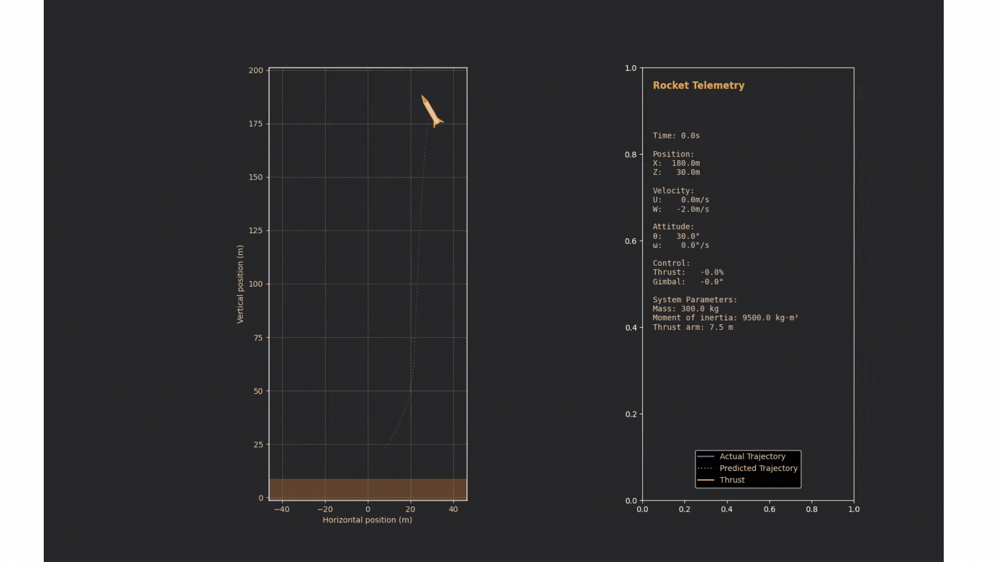

# Rocket (Non-linear Model Predictive Control) NMPC Simulation 

A Python implementation of Non-linear Model Predictive Control (NMPC) for rocket flight trajectory optimization. This project provides a high-fidelity simulation of rocket maneuvers with real-time visualization and telemetry display.



This repository is inspired by https://github.com/MMehrez/MPC-and-MHE-implementation-in-MATLAB-using-Casadi

## Requirements

- Python 3.8+
- NumPy
- CasADi
- Matplotlib
- SciPy
- FFmpeg (for animation export)

## Installation

1. Clone the repository:
```bash
git clone https://github.com/ChenDavidTimothy/rocket-nmpc.git
cd rocket-nmpc
```

2. Install the required Python packages:
```bash
pip install numpy casadi matplotlib scipy
```

3. Install FFmpeg (required for animation export):
```bash
# Windows (using chocolatey)
choco install ffmpeg
```

4. IPOPT Solver installation:
```bash
https://coin-or.github.io/Ipopt/INSTALL.html
```

## Project Structure

```
├── src/
│   ├── simulation/
│   │   ├── rocket_simulation.py    # MPC implementation and dynamics
│   │   └── rocket_animation.py     # Visualization and animation
│   │
│   ├── utils/
│       └── dynamics_derivation.py  # Symbolic dynamics derivation
│        
└── main.py                  # Main execution file
```

## Usage

1. Basic execution:
```python
python rocket_main.py
```

2. Configure rocket parameters in `main.py`:
```python
params = RocketMPCParams(
    mass=300.0,          # Mass [kg]
    g=9.81,              # Gravity [m/s^2]
    l=7.5,               # Thrust moment arm [m]
    J=9500.0,            # Moment of inertia [kg*m^2]
    F_max=10000.0,       # Maximum thrust [N]
    gimbal_max=np.pi/30  # Maximum gimbal angle [rad]
)
```

3. Adjust initial and target states:
```python
x0 = np.array([180, 30, 0.0, -2.0, np.pi/6, 0])  # Initial state
xs = np.array([30, 0.0, 0.0, 0.0, 0.0, 0.0])     # Target state
```

4. Customize visualization parameters:
```python
animation_params = RocketAnimationParams(
    rocket_length=15.0,
    rocket_width=2,
    fps=30,
    margin_factor=1.2
)
```

## Algorithm Details

The Nonlinear Model Predictive Control (MPC) implementation:

1. **State Space**: 
   - Position (x, z)
   - Velocity (u, w)
   - Attitude (θ)
   - Angular velocity (q)

2. **Control Inputs**:
   - Thrust magnitude (F)
   - Gimbal angle (μ)

3. **Optimization**:
   - Nonlinear optimization using CasADi
   - Custom cost function for landing objectives
   - State and control constraints

## Visualization Features

The animation system includes:
- Dynamic rocket rendering with fins and nozzle
- Real-time thrust visualization
- Telemetry display panel showing:
  - Position and velocity
  - Attitude and angular velocity
  - Thrust and gimbal angles
  - System parameters
- Trajectory prediction

## License

This project is licensed under the MIT License - see the [LICENSE](LICENSE) file for details.

## References

The 2D rocket dynamics are adapted from 3D rocket dynamics that is based on the following research:

```bibtex
@article{santos2023thrust,
  title={Thrust vector control and state estimation architecture for low-cost small-scale launchers},
  author={Santos, P. D. and Oliveira, P.},
  journal={arXiv preprint arXiv:2303.16983},
  year={2023}
}
```

## Author

David Timothy - chendavidtimothy@gmail.com
GitHub: [@ChenDavidTimothy](https://github.com/ChenDavidTimothy)
